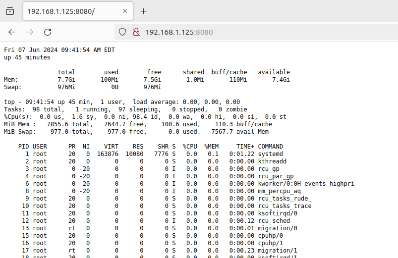

# mc-home-server
Tools for hosting a Minecraft server at home.

# Getting Started
First, install a Linux distribution on the server. A headless [Debian install](https://www.debian.org/distrib/) is recommended to use minimal computer resources. Once the OS is installed, set up the server with a static IP address (a tutorial for that can be found [here](https://www.techrepublic.com/article/set-static-ip-address-debian-server/)) so that clients can find the server at the same address every time.

If you went with the headless Debian install, you'll notice that it is very barebones. As such, it may be necessary to install a few packages: `gcc`, `make`, `git`, and `screen` should do (though you may need `sudo` as well). On Debian this can be done with the command `sudo apt-get install [package-name]`. You may want to make sure all packages are up-to-date first with `sudo apt-get update`.

To start off, clone this repository into a directory of your choice: `git clone https://github.com/aCallin/mc-home-server.git`. From this point on we'll install each component of the server manually, starting with the tools.

The first tool is a heartbeat program that allows you to query the server's health and status from the web. All you need to do is type http://server-ip-address:8080 on a web browser while the program is running and you'll see something like the following:  

